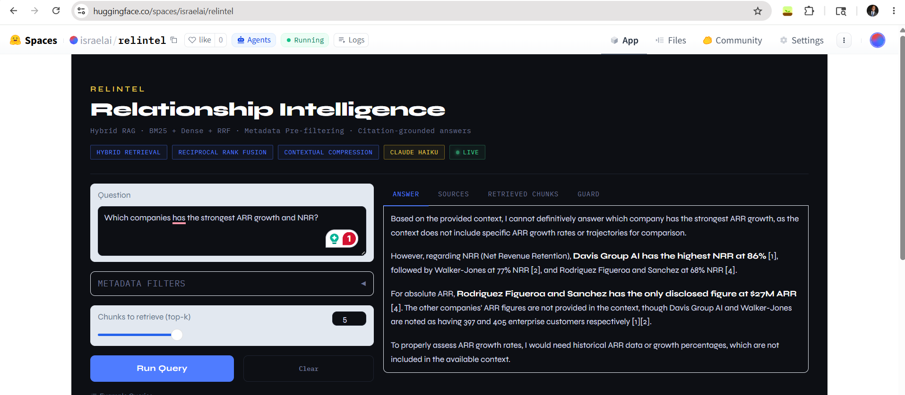

# RelIntel — Relationship Intelligence RAG System

Organizations often struggle to turn scattered relationship data into timely,
actionable intelligence for outreach, warm introductions, and relationship-driven
decision-making. In this project, we build a retrieval-augmented intelligence
system that connects notes, profiles, and relationship context so users can ask
natural-language questions and quickly surface relevant people, connections, and
next-best actions.

## Deployed Demo (Hugging Face Spaces)



---

## Architecture

```
Data Layer (Phase 1)
  companies.json · contacts.json · deals.json · interactions.json
        │
        ▼
Ingestion Pipeline (Phase 2)                  src/ingest.py
  Chunking (sentence-boundary, word-count ceiling)
  Embedding (TF-IDF + LSA, 256-dim, fully local)
  ChromaDB (persistent HNSW, cosine space)
  chunks.json (BM25 corpus)
        │
        ▼
Hybrid Retrieval (Phase 3)                    src/retriever.py
  Metadata Pre-Filter → Dense (ChromaDB ANN) + BM25 (Okapi)
  Reciprocal Rank Fusion (k=60)
  Contextual Compression
        │
        ▼
Generation Layer (Phase 4)                    src/generator.py
  Numbered-citation prompt assembly
  Anthropic SDK call (claude-haiku-4-5-20251001)
  Citation parser + Hallucination guard (3 checks)
        │
        ▼
RAGAS Evaluation (Phase 5)                    src/evaluate.py
  4 experiments × 25 samples × 5 metrics
  results/ragas_results.json
  results/ragas_summary.csv
  results/ragas_report.md
```

---

## Quick Start

```bash
# 1. Install dependencies
pip install -r requirements.txt

# 2. Generate synthetic dataset
python src/generate_data.py

# 3. Build ingestion pipeline (chunks + embeddings + ChromaDB)
python src/ingest.py

# 4. Run a query
export ANTHROPIC_API_KEY=sk-ant-...
python src/query.py --query "Which companies are showing strong ARR growth?"

# 5. Interactive REPL
python src/query.py --interactive
# Filter syntax: what are the latest Fintech updates? [sector=Fintech]

# 6. Run full RAGAS evaluation
python src/evaluate.py

# Quick smoke run (hybrid only, 5 samples)
python src/evaluate.py --quick

# Retrieval-only (no API calls needed)
python src/evaluate.py --retrieval-only
```

---

## Evaluation (Phase 5)

### Metrics

| Metric | Measures | Component |
|---|---|---|
| **Context Precision** | Fraction of retrieved chunks that are relevant | Retriever |
| **Context Recall** | Fraction of ideal evidence that was retrieved | Retriever |
| **Faithfulness** | Claims in answer grounded in context (↑ = less hallucination) | Generator |
| **Answer Relevance** | Answer addresses the question (↑ = on-topic) | Generator |
| **Answer Correctness** | Semantic match between answer and ground truth | End-to-end |

### Experiments

| ID | Description | Purpose |
|---|---|---|
| `hybrid` | BM25 + Dense + RRF + Compression | Primary system |
| `dense` | Dense (ChromaDB ANN) only | Ablation: BM25 contribution |
| `bm25` | BM25 only | Ablation: dense contribution |
| `hybrid_no_compress` | Hybrid without contextual compression | Ablation: compression effect |

### Dataset Categories

| Category | n | What it tests |
|---|---|---|
| `factual_lookup` | 3 | Single-fact extraction; context_precision |
| `multi_hop_synthesis` | 3 | Multi-chunk synthesis; context_recall |
| `comparison` | 2 | Cross-entity ranking; retrieval diversity |
| `temporal` | 3 | Date-range filter precision |
| `source_filtered` | 2 | source_type metadata filter |
| `sentiment_filtered` | 2 | sentiment metadata filter |
| `deal_stage_filtered` | 2 | deal_stage metadata filter |
| `team_filtered` | 1 | logged_by metadata filter |
| `lexical` | 2 | Proper noun retrieval; BM25 advantage |
| `negation_absence` | 2 | Hallucination under missing context |
| `aggregation` | 3 | Multi-entity enumeration; context_recall |

### Expected Hypotheses

1. **hybrid > dense** on `lexical` category (proper noun matching)
2. **hybrid > bm25** on `multi_hop_synthesis` (semantic generalisation)
3. **hybrid_no_compress ≤ hybrid** on `faithfulness` (compression reduces noise)
4. `negation_absence` samples should have **faithfulness = 1.0** if the model
   correctly says "not in context" rather than hallucinating

### Interpreting Results

```
context_precision ≥ 0.70  → Retriever is precise; acceptable noise level
context_recall    ≥ 0.70  → Good evidence coverage
faithfulness      ≥ 0.80  → Low hallucination risk
answer_relevance  ≥ 0.80  → Answers on-topic
answer_correctness ≥ 0.60 → Factually consistent with ground truth
```

If any metric falls below threshold, see `results/ragas_report.md` →
**Recommended Next Steps** for targeted improvements.

---

## Project Structure

```
relintel/
├── data/
│   ├── companies.json          # 50 companies (Phase 1)
│   ├── contacts.json           # 200 contacts
│   ├── deals.json              # 150 deals
│   ├── interactions.json       # 500 interactions
│   ├── chunks.json             # 500 enriched chunks (Phase 2)
│   ├── embedder.pkl            # Fitted TF-IDF+LSA pipeline
│   ├── chroma/                 # Persistent ChromaDB vector store
│   ├── schema.md               # Data model documentation
│   └── eval_dataset.json       # 25 RAGAS evaluation samples (Phase 5)
├── results/
│   ├── ragas_results.json      # Full per-sample scores
│   ├── ragas_summary.csv       # Aggregate metric table
│   └── ragas_report.md         # Human-readable evaluation report
├── src/
│   ├── generate_data.py        # Phase 1: synthetic dataset
│   ├── ingest.py               # Phase 2: chunking + embedding + ChromaDB
│   ├── retriever.py            # Phase 3: hybrid retrieval engine
│   ├── generator.py            # Phase 4: generation + citation + guard
│   ├── query.py                # Phase 4: CLI query runner
│   ├── eval_dataset.py         # Phase 5: 25-sample evaluation dataset
│   └── evaluate.py             # Phase 5: RAGAS pipeline
├── requirements.txt
└── README.md
```

---

## Production Notes

### Swapping the Embedder
The TF-IDF+LSA embedder in Phase 2 is intentionally local (no external downloads).
For production, replace `build_embedder()` in `ingest.py` with:
```python
# Voyage AI (best for financial/relationship text)
from voyageai import Client
model = Client().embed

# OpenAI
from openai import OpenAI
model = OpenAI().embeddings.create(model="text-embedding-3-small", ...)

# Local sentence-transformers (once cached)
from sentence_transformers import SentenceTransformer
model = SentenceTransformer("all-MiniLM-L6-v2")
```

### Scaling Beyond 500 Chunks
- ChromaDB handles millions of vectors; no changes needed
- BM25 index rebuilds on `ingest.py` — for streaming updates, consider
  Elasticsearch with BM25 + dense hybrid (built-in)
- For multi-tenant isolation: partition ChromaDB by tenant_id metadata filter

### Adding Cross-Encoder Re-ranking
Insert between RRF fusion and contextual compression in `retriever.py`:
```python
from sentence_transformers import CrossEncoder
reranker = CrossEncoder("cross-encoder/ms-marco-MiniLM-L-6-v2")
scores = reranker.predict([(query, r.text) for r in fused_results])
fused_results = [r for _, r in sorted(zip(scores, fused_results), reverse=True)]
```
